# Universidad EAFIT
# Curso ST0263 Tópicos Especiales en Telemática, 2019-1
# Profesor: Edwin Montoya M. – emontoya@eafit.edu.co
# Profesor: Alvaro Ospina - aeospinas@eafit.edu.co

# HIVE

## TABLAS SENCILLAS EN HIVE

## 1. Conexión al cluster Hadoop

Ambari Web

    https://hdp1.dis.eafit.edu.co

Interface para HIVE (Data Analytics Studio):

    https://das1.dis.eafit.edu.co

Terminal:

    https://hdp1shell.dis.eafit.edu.co

Usuarios:

    username: user_vpn
    password: <enviado por email>

## 2. Los archivos de trabajo hdi-data.csv y export-data.csv

```
/user/<user_vpn>/datasets/onu
```

## 3. Gestión y Consultas vía Terminal

1. ejecutar Hive:

```
$ beeline
beeline> !connect jdbc:hive2://<server-hive>:2181/;serviceDiscoveryMode=zooKeeper;zooKeeperNamespace=hiveserver2

o

beeline> !connect jdbc:hive2://127.0.0.1:2181/;serviceDiscoveryMode=zooKeeper;zooKeeperNamespace=hiveserver2

o

beeline> !connect jdbc:hive2://sandbox-hdp.hortonworks.com:2181/;serviceDiscoveryMode=zooKeeper;zooKeeperNamespace=hiveserver2
```

2. Crear la base de datos

```
> create database user_vpn;
```

3. Crear la tabla HDI en Hive:
```
> use <user_vpn>;
> CREATE TABLE HDI (id INT, country STRING, hdi FLOAT, lifeex INT, mysch INT, eysch INT, gni INT) ROW FORMAT DELIMITED FIELDS TERMINATED BY ',' STORED AS TEXTFILE;
```

Nota: Esta tabla la crea en una BASE DE DATOS 'user_vpn'
```
> use user_vpn;
> show tables;
> describe hdi;
```

4. cargar los datos desde el Gateway (local) a la tabla HDI:

```
> load data local inpath '/home/user_vpn/datasets/onu/hdi-data.csv' into table HDI;
```

cargar datos desde el HDFS:

```
> load data inpath '/user/<user_vpn>/datasets/onu/hdi-data.csv' into table HDI;
```

5. hacer consultas y cálculos sobre la tabla HDI:
```
> select * from hdi;
>
> select country, gni from hdi where gni > 2000;    
>
```

### EJECUTAR UN JOIN CON HIVE:

1. Obtener los datos base: export-data.csv

usar los datos en 'datasets' de este repositorio.

2. Iniciar hive y crear la tabla EXPO:

```
$ beeline
> use <user_vpn>;
> CREATE TABLE EXPO (country STRING, expct FLOAT) ROW FORMAT DELIMITED FIELDS TERMINATED BY ',' STORED AS TEXTFILE;
```

3. Carga los datos:export-data.csv
```
>LOAD DATA LOCAL INPATH 'export-data.csv' INTO TABLE EXPO;
```

4. EJECUTAR EL JOIN DE 2 TABLAS:
```
> SELECT h.country, gni, expct FROM HDI h JOIN EXPO e ON (h.country = e.country) WHERE gni > 2000;
```


### WORDCOUNT EN HIVE:
```
> use <user_vpn>;
>CREATE EXTERNAL TABLE docs (line STRING) STORED AS TEXTFILE LOCATION '/datasets/gutenberg-small/';
```

// ordenado por palabra
```
>SELECT word, count(1) AS count FROM (SELECT explode(split(line,' ')) AS word FROM docs) w GROUP BY word ORDER BY word;
```
// ordenado por frecuencia de menor a mayor
```
>SELECT word, count(1) AS count FROM (SELECT explode(split(line,' ')) AS word FROM docs) w GROUP BY word ORDER BY count;
```

RETO:

¿cómo llenar una tabla con los resultados de un Query? por ejemplo, como almacenar en una tabla el diccionario de frecuencia de palabras en el wordcount?

// TENER EN CUENTA LA CARGA LOCAL o DESDE EL HDFS de los DATOS a HIVE:

## 3. Gestion y Consultas desde Ambari Web - Hive View

* Inicio

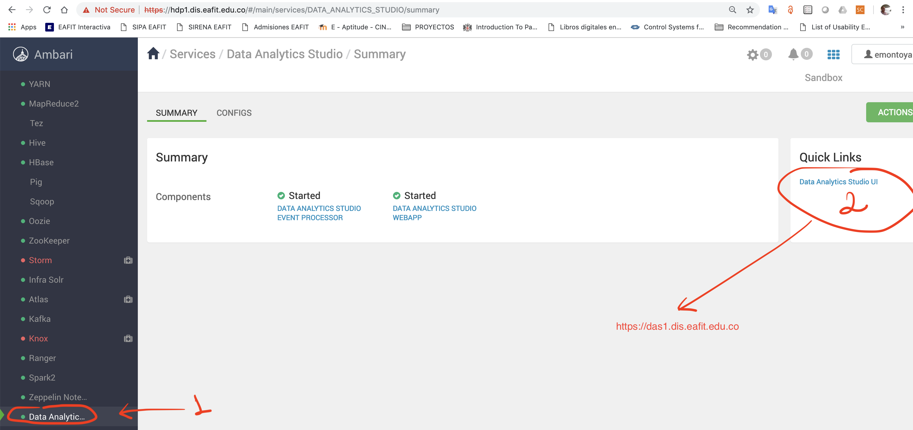

* Consultas

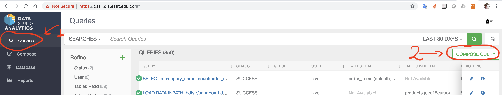
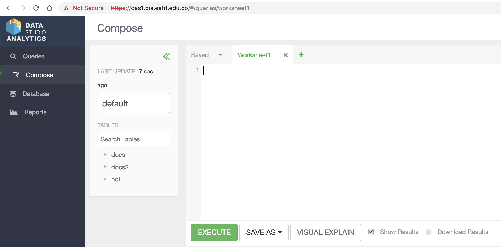

* crear base de datos

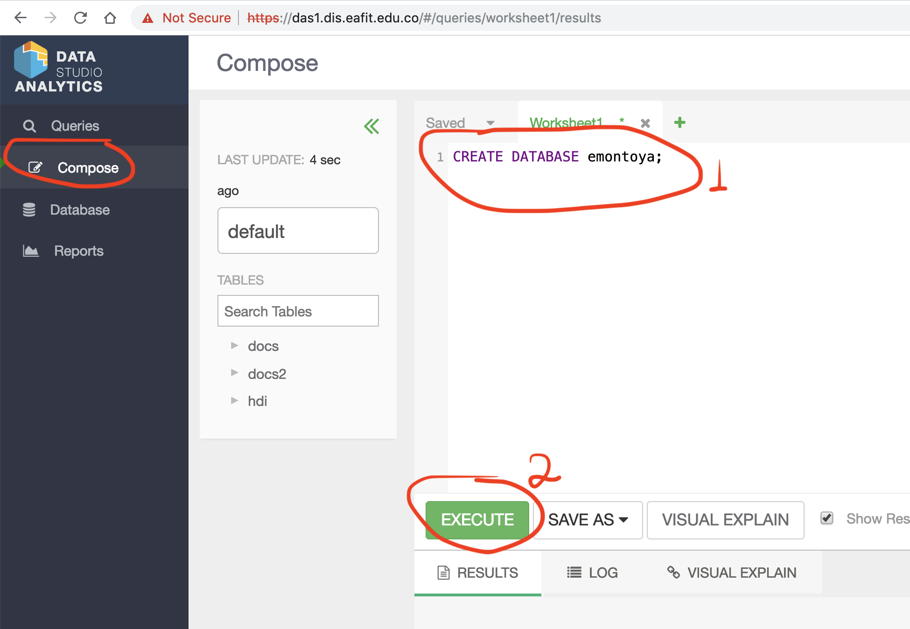

* mostrar base de datos

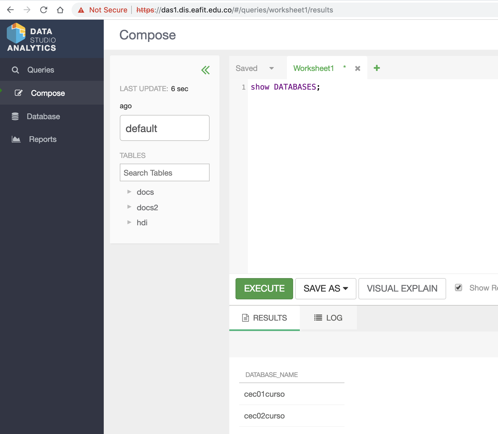

* cambiar de base de datos

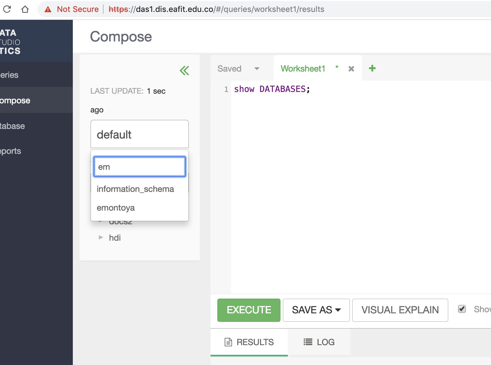

* tablas de una base de datos

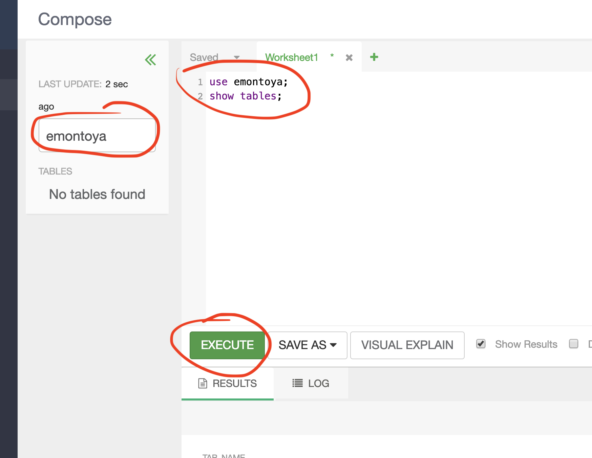

* crear tabla de una base de datos

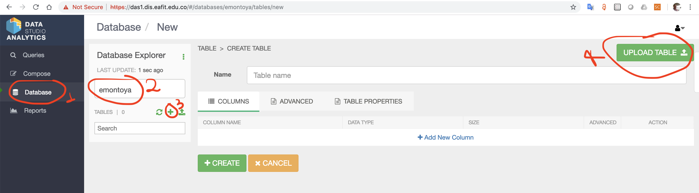
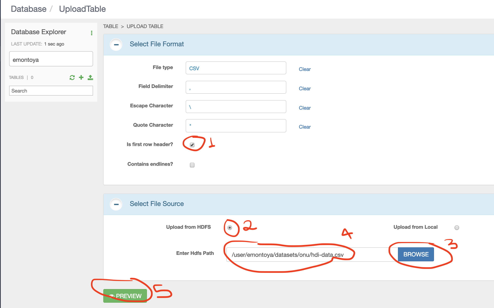
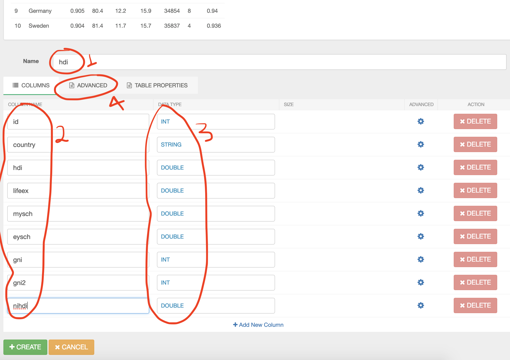
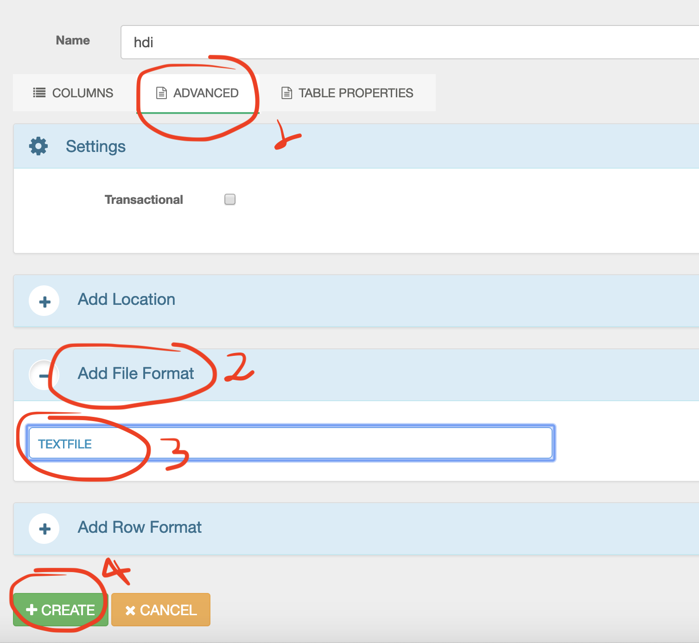

* descripción tabla tabla hdi

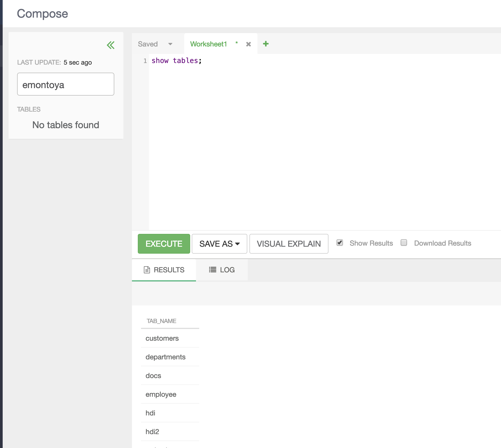

* consulta tabla HDI

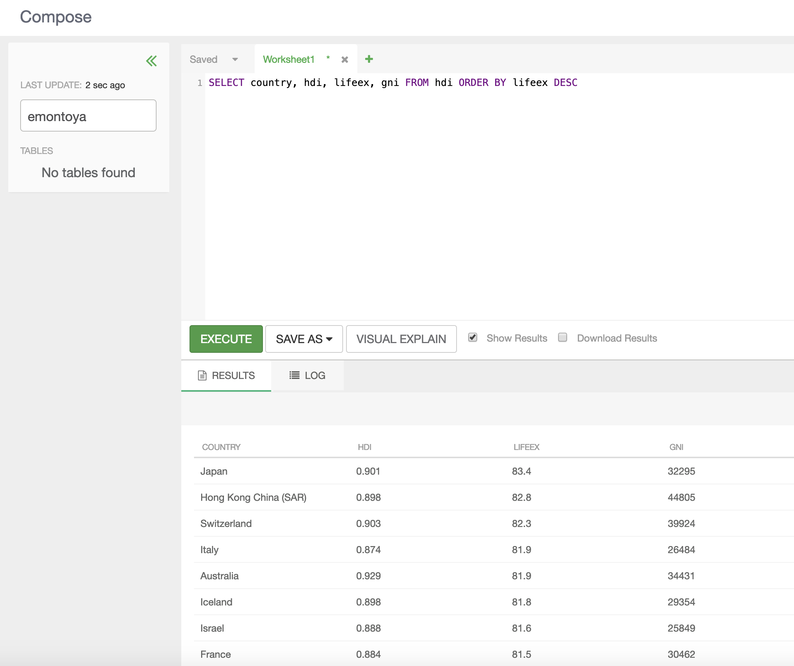


# Apache Sqoop

## Datos en MySQL

```
En el servidor 192.168.10.80, se tiene Mysql con:
Base de datos: “cursodb”
Tabla: “employee”
User: curso/curso
$ mysql –u curso –p
Enter password: ******
mysql> use cursodb;
```

## Comandos Sqoop

## Taller con base de datos 'cursodb'

### Importar UNA TABLA de una base de datos (cursodb) (tipo mysql) hacia HDFS
```
$ sqoop import --connect jdbc:mysql://192.168.10.80:3306/cursodb --username curso --password curso --table employee --target-dir /user/<username>/employee -m 1 --mysql-delimiters
```

// listar archivos:
```
$ hdfs dfs -ls /user/<username>/employee
```
### Importar TODAS LAS TABLAS de una base de datos (cursodb) (tipo mysql) hacia HDFS:
```
sqoop import-all-tables --connect jdbc:mysql://192.168.10.80:3306/cursodb --username=curso --password=curso --warehouse-dir /user/<username>/cursodb --mysql-delimiters -m 1
```
// listar archivos:
```
$ hdfs dfs -ls /user/<username>/cursodb
$ hdfs dfs -ls /user/<username>/cursodb/employee
```

### Opción 1: Crear tabla HIVE a partir de una tabla Mysql (NO CARGA DATOS, SOLO LA CREA):
```
$ sqoop create-hive-table --connect jdbc:mysql://192.168.10.80:3306/cursodb --username curso --password=curso --table employee --hive-database <username> --hive-table employee -m 1--mysql-delimiters
```
### Opción 1: Cargar datos a una tabla HIVE: 
```
USE DATABASE <username>
LOAD DATA INPATH '/user/<username>/employee/part-00000' into table employee;
```
### Opción 2: Crear tabla HIVE y CARGAR DATOS a partir de una tabla Mysql:
```
$ sqoop import --connect jdbc:mysql://192.168.10.80:3306/cursodb --username=curso --password=curso --hive-database <username> --create-hive-table --warehouse-dir=/user/<username>/employeetmp --hive-import --mysql-delimiters -m 1 
```

### cargar datos a una tabla Hive Manualmente:
```
$ beeline
> use <user_vpn>;
> CREATE TABLE employee2 (empid INT, name  STRING, salary INT) ROW FORMAT DELIMITED FIELDS TERMINATED BY ','  LINES TERMINATED BY '\n' STORED AS TEXTFILE;
>
```
// Cargar datos a Hive Manualmente:
```
> load data inpath '/user/<user_vpn>/employee/part-m-00000' into table database.employee2;
OK                          
> select * from employee2;
OK
101 name1 1800
102 name2 1500
103 name3 1000
104 name4 2000
105 name5 1600
taken: 0.269 seconds, Fetched: 5 row(s) Time
> 
```
### Importar todas las tablas de una Base de datos (Mysql) y cargar todos los datos:
```
sqoop import-all-tables --connect jdbc:mysql://192.168.10.80:3306/cursodb --username=curso --password=curso --hive-database <username> --create-hive-table --warehouse-dir=/user/<username>/cursodbtmp --hive-import --mysql-delimiters -m 1 
```

## Taller con base de datos 'retail_db'

### Transferir todas las tablas de una base de datos (tipo mysql) hacia HIVE vía HDFS:

```
sqoop import-all-tables --connect jdbc:mysql://192.168.10.80:3306/retail_db --username=retail_dba --password=caoba --warehouse-dir /user/<user_vpn>/retail_db --mysql-delimiters -m 1

sqoop import-all-tables --connect jdbc:mysql://192.168.10.80:3306/retail_db --username=retail_dba --password=caoba --hive-database <user_vpn> --create-hive-table --warehouse-dir=/user/<user_vpn>/retail_db --hive-import --mysql-delimiters -m 1 

sqoop import-all-tables --connect jdbc:mysql://192.168.10.80:3306/retail_db --username=retail_dba --password=caoba --hive-database <user_vpn> --hive-overwrite --warehouse-dir=/user/<user_vpn>/retail_db --hive-import --mysql-delimiters -m 1 
```
### Sqoop export hacia mysql:

// Crear una Tabla 'username_employee2' en Mysql con los mismos atributos de 'username_employee'
```
mysql> USE cursodb;
mysql> CREATE TABLE username_employee2 (  emp_id INT NOT NULL,  name VARCHAR(45),  salary INT,  PRIMARY KEY (emp_id));
```

// Asumiendo datos separados por ”,” en HDFS en:

/user/<username>/mysql_in/*

```
$ sqoop export --connect jdbc:mysql://127.0.0.1:3306/cursodb --username curso -P --table username_employee2 --export-dir /user/<user_vpn>/mysqlOut
```

## MySQL vs Hive

### consulta hecha en MySQL de Promedio de salario de Empleados:

    $ mysql -u curso -p
    password: curso
    mysql> use cursodb;
    mysql> select AVG(salary) from employee;
    +-------------+                                                                    
    | AVG(salary) |                                                                    
    +-------------+                                                                    
    |   1580.0000 |                                                                    
    +-------------+                                                                    
    1 row in set (0.00 sec)                                                            
                                                                                   
    mysql>

### consulta hecha en HIVE de Promedio de salario de Empleados:

    Via Ambari-Web> Hive View 2.0

    # crear la tabla externa:

    use <user_vpn>;

    create external table employee (emp_id int, name string, salary float) 
    ROW FORMAT DELIMITED FIELDS TERMINATED BY ','  
    LINES TERMINATED BY '\n' 
    STORED AS textfile;

    select * from employee;

    select AVG(salary) from employee;

# LAB-ESTUDIANTE:

1. Compare el rendimiento del wordcount en hive vs pig manteniendo el mismo dataset (gutenberg-small)